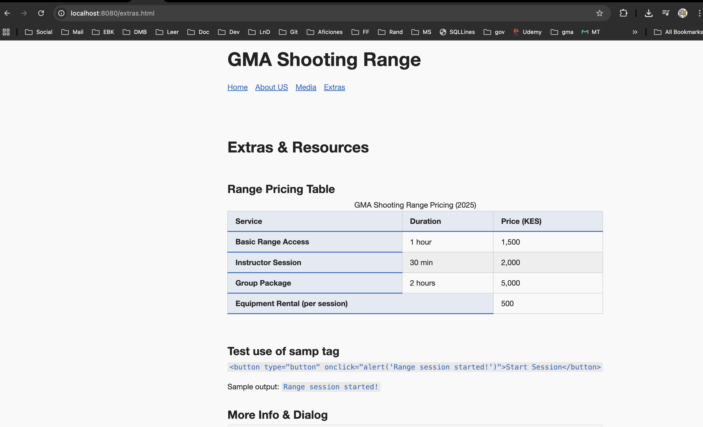
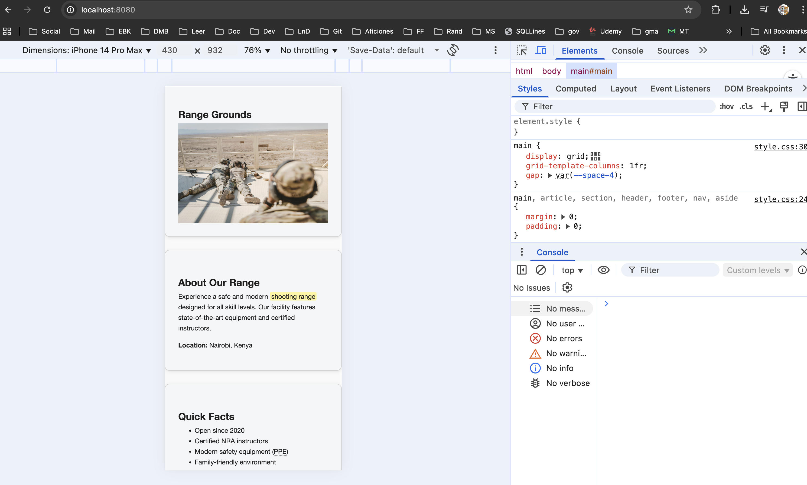
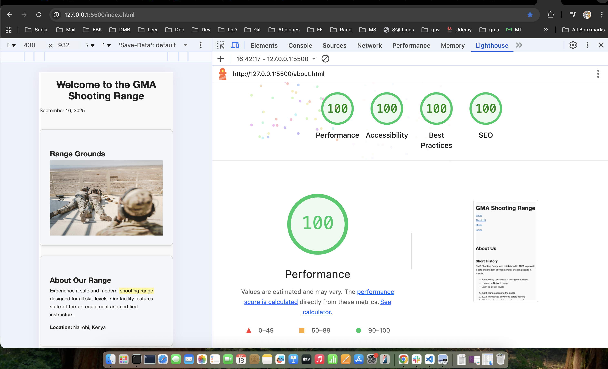

# GMA Shooting Range — Website

A continuation of the [HTML-ONLY](https://github.com/gmaroko/html-web-exe-wk1) site

## Purpose
This project is an assignment to demonstrate a modern, accessible, and semantic HTML5 website for a fictional shooting range. It showcases best practices in HTML5 structure, media, accessibility, and interactive elements, without using CSS or JavaScript.

## Technologies Used

- HTML5
- CSS
- Docker

## Disclaimer

All content, names, and media in this project are placeholders for educational purposes only and are not factual or representative of any real organization or individuals.

## Pages & HTML5 Features

- [**index.html**](https://gmaroko.github.io/html-web-exe-wk1/index.html) — Home page using semantic layout elements (`<header>`, `<nav>`, `<main>`, `<article>`, `<section>`, `<aside>`, `<footer>`), skip link, and accessibility features.
- [**about.html**](https://gmaroko.github.io/html-web-exe-wk1/about.html) — About page with semantic sections, unordered and ordered lists, a definition list, and a short history section.
- [**media.html**](https://gmaroko.github.io/html-web-exe-wk1/media.html) — Media gallery demonstrating `<video>` with captions (`.vtt`), `<audio>` with controls, responsive images using `<picture>`, and `<figure>` with `<figcaption>`.
- [**extras.html**](https://gmaroko.github.io/html-web-exe-wk1/extras.html) — Extras page with a semantic `<table>` (caption, thead, tbody, tfoot, th scope), `<details>`, `<dialog>`, `<progress>`, `<meter>`, blockquote, and code sample.

## Setup

You can view this project in two ways:

1. **Locally:**
	- Download or clone the [repository](https://github.com/gmaroko/html-web-exe-wk1/).
    ```bash
    git clone https://github.com/gmaroko/html-web-exe-wk1/
    cd html-web-exe-wk1
    ```
	- Open the landing page (`index.html`) in your web browser.

2. **Online (Recommended):**
	- Visit the Deployed Site at: [GMA Shooting Range](https://gmaroko.github.io/html-web-exe-wk1/)


---

## Design Decisions

- **Palette:**
    - Light/dark backgrounds, strong brand blue (`--brand`), high-contrast text (`--fg`, `--brand-contrast`), and muted accents (`--muted`).
- **Type Scale:**
    - Modular scale: h1 (2.5rem), h2 (2rem), h3 (1.5rem), body (1rem), using a system font stack for performance and accessibility.
- **Spacing Scale:**
    - CSS variables: `--space-1` (0.25rem) to `--space-5` (4rem) for consistent rhythm and layout.
- **Components:**
    - `.card` for content blocks, responsive tables with `.table-wrapper`, accessible skip link, and utility classes for spacing and alignment.

## Accessibility Notes

- **Contrast:**
    - All text and interactive elements meet WCAG AA contrast guidelines.
- **Focus Styles:**
    - Custom focus indicators for links, buttons, and summary elements; skip link is visible on focus.
- **Reduced Motion:**
    - Animations and transitions are disabled for users with `prefers-reduced-motion` enabled.
- **Landmarks & Hierarchy:**
    - Semantic headings, ARIA labels, and landmark elements are used throughout.

## Docker Usage

Build the image:
```sh
docker build -t 06992014/html5-css3-site:lab2 .
```

Run the container locally:
```sh
docker run --rm -p 8080:80 06992014/html5-css3-site:lab2
```

Tag the image:
```sh
docker tag 06992014/html5-css3-site:lab2 06992014/html5-css3-site:latest
```

Push to Docker Hub:
```sh
docker push 06992014/html5-css3-site:latest
```

## Screenshots

### Desktop


### Mobile


### Lighthouse report - Local



### Lighthouse report - Live

## Live Link

[GMA Shooting Range](https://gmaroko.github.io/html-web-exe-wk1/)
